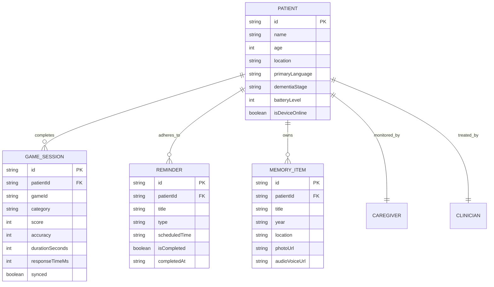

# MindCare NER — Data Model & Schema

## Entity Relationship Architecture

```mermaid
erDiagram
    PATIENT ||--o{ GAME_SESSION : completes
    PATIENT ||--o{ REMINDER : adheres_to
    PATIENT ||--o{ MEMORY_ITEM : owns
    PATIENT ||--|| CAREGIVER : monitored_by
    PATIENT ||--|| CLINICIAN : treated_by

    PATIENT {
        string id PK
        string name
        int age
        string location
        string primaryLanguage
        string dementiaStage
        int batteryLevel
        boolean isDeviceOnline
    }

    GAME_SESSION {
        string id PK
        string patientId FK
        string gameId
        string category
        int score
        int accuracy
        int durationSeconds
        int responseTimeMs
        boolean synced
    }

    REMINDER {
        string id PK
        string patientId FK
        string title
        string type
        string scheduledTime
        boolean isCompleted
        string completedAt
    }

    MEMORY_ITEM {
        string id PK
        string patientId FK
        string title
        string year
        string location
        string photoUrl
        string audioVoiceUrl
    }
```
